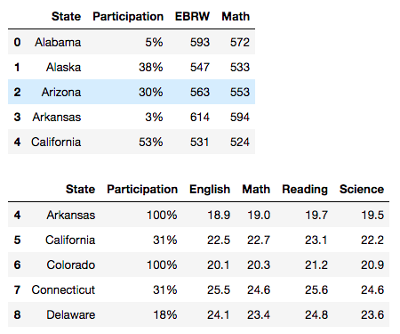

## Statistical Analysis of Participation in Standardized Tests [[view code]](http://nbviewer.jupyter.org/github/marcotav/exploratory-data-analysis/blob/master/increasing-the-participation-rate-in-standardized-tests/notebooks/project-1-marco-tavora.ipynb) 
     

**The code is available [here](http://nbviewer.jupyter.org/github/marcotav/exploratory-data-analysis/blob/master/increasing-the-participation-rate-in-standardized-tests/notebooks/project-1-marco-tavora.ipynb) or by clicking on the [view code] link above.**


<br>

<p align="center">
  
</p>                                                                  
<p align="center">
  <a href="#ov"> Overview </a> •
  <a href="#ps"> Problem Statement </a> •
  <a href="#data"> Brief introduction to the data</a> •
  <a href="#eda"> EDA Steps</a><br> •
  <a href="#dis"> Descriptive and Inferential Statistics </a><br> 
</p>


<a id = 'ov'></a>
## Overview
Suppose that the College Board, a nonprofit organization responsible for administering the SAT (Scholastic Aptitude Test), seeks to increase the rate of high-school graduates who participate in its exams. This project's aim is to make recommendations about which measures the College Board might take in order to achieve that.

<a id = 'ps'></a>
## Problem Statement
The problem we need to solve is to how to make actionable suggestions to the College Board to help them increase the participation rates in their exams. For that we need to perform an exploratory data analysis (EDA) to find appropriate metrics that can be adjusted by the College Board accordingly. Performing the EDA we must among other things:
- Find relevants patterns in the data
- Search for possible relations between subsets of the data (for example, are scores and participation rates correlated? If yes how?)
- Test hypotheses about the data using statistical inference method
- Identify possible biases in the data and, if possible, suggest corrections

<a id = 'data'></a>
## Brief introduction to the data

The data is based on the SAT and the ACT (which stands for American College Testing and it is administered by another institution, namely, the ACT. Inc) exams from around the United States in 2017.

The data contains:

- Average SAT and ACT scores by state (scores for each section of each exam)
- Participation rates for both exams by state.

Both SAT and ACT are standardized tests for college admissions and are similar in content type but have some differences in structure. A few relevant differences are:
- The ACT has a Science Test and the SAT does not
- There is a SAT Math Section for which the student is not allowed to use a calculator
- The SAT's College Board joins Reading and Writing into one score, the "Evidence-Based Reading and Writing" whereas in the ACT the tests are separated.

<a id = 'eda'></a>
## EDA Steps

### Importing basic modules

We first need to import Python libraries including:
- `Pandas`, for data manipulation and analysis 
- `SciPy` which is a Python-based ecosystem of software for mathematics, science, and engineering. 
- `NumPy` which is a library consisting of multidimensional array objects and a collection of routines for processing of array. 
- `Statsmodels` which is a Python package that allows users to explore data, estimate statistical models, and perform statistical tests and complements `SciPy`;
- `Matplotlib` is a plotting library for the Python and NumPy;
- `Seaborn` is complimentary to Matplotlib and it specifically targets statistical data visualization
- `Pylab` is embedded inside Matplotlib and provides a Matlab-like experience for the user. It imports portions of Matplotlib and NumPy.

This information was taken directly from the documentation.

### Loading the data and performing basic operations.

To read our data (which is in the form of `csv` files), into a `DataFrame` structure, we use the method `read_csv()` and pass in each file name as a string:

```
sat = pd.read_csv('sat.csv')
act = pd.read_csv('act.csv')
```
Note that the first columns of both tables seem to be identical to the DataFrame indexes. We can quickly confirm that using an `assert` statement. When an `assert` statement is encountered, Python evaluates it and if the expression is false raises an `AssertionError` exception this [link](https://www.tutorialspoint.com/index.htm) contains more details.

```
assert (sat.index.tolist() == sat['Unnamed: 0'].tolist())
assert (act.index.tolist() == act['Unnamed: 0'].tolist())
```
After some data wrangling and feature engineering, the SAT (top) and ACT (bottomw) `DataFrames` become:

<br>

<p align="center">
  
</p>                                   
                                 
<br> 

The SAT table displays three different averages for each state: 
- The first column is the state 
 - The second column is the average participation of students in each state
 - The third and fourth columns are the average scores in the Math and Evidence-Based Reading and Writing tests (the name EBRW is explained above).

The ACT table displays the following averages for each State: 
  - The first column is the state 
  - The second column is the average participation of students in that state
  - The third, fourth, fifth and sixth columns are the scores in the English, Math, Reading and Science tests

We can look for problems with the data for example:

- Using `info()` 
- Using `describe()`
- Looking at the last rows and or last columns which frequently contain aggregate values
- Looking for null values
- Outliers

The third item was taken care of. There were no null values but there are outliers as we shall see when we perform the plotting. I will convert the columns 'Participation' into `floats` using a function to extract the % but keeping the scale between 0 and 100. The `.replace( )` method takes the argument `regex` =`True` because `type('%')` = `str`. 

```
def perc_into_float(df,col):
    return df[col].replace('%','',regex=True).astype('float')
df_sat['Participation'] = perc_into_float(df_sat,'Participation')
df_act['Participation'] = perc_into_float(df_act,'Participation')
```

I now will create a dictionary for each column mapping the State to its respective value for that column using the function:
```
def dict_all(df,cols,n):
    return [df.set_index('State').to_dict()[cols[i]] for i in range(1,len(cols))][n]
```
The dicitonaries are:
```
dsat_part = dict_all(df_sat,df_sat.columns.tolist(),0)
dsat_EBRW = dict_all(df_sat,df_sat.columns.tolist(),1)
dsat_math = dict_all(df_sat,df_sat.columns.tolist(),2)
```
Now I create one dictionary where each key is the column name, and each value is an iterable (a list or a Pandas Series) of all the values in that column. The following function accomplishes that:

```
def dict_col(df):
    return {col:df[col].tolist() for col in df.columns}
```
Merging the dataframes on the state column and changing the names of the columns to distinguish between the SAT columns and the ACT columns:

```
df_total = pd.merge(df_sat, df_act, on='State')
df_total = pd.merge(df_sat, df_act, on='State')
df_total.columns = ['State','Participation_SAT (%)','EBRW_SAT','Math_SAT','Participation_ACT (%)','English_ACT','Math_ACT','Reading_ACT','Science_ACT']
```
I know write a function from scratch without loops to compute standard deviation and calculate the standard deviation of each numeric column in both data sets:

```
def stdev(X):
    n = len(X)
    return ((1.0/n)*np.sum([(x-np.mean(X))**2 for x in X]))**(0.5)
cols = df_total.columns[1:].tolist()
sd = [round(stdev([df_total[col].tolist() for col in cols][i] ) ,3) for i in range(0,len(cols))]
```
Pandas calculates `std` DataFrame using n-1 as denominator instead of n. Setting the number of `ddof`=0 solves this issue. I will now turn the list `sd` into a new observation in your dataset. I first put `State` as index and then concatenate the new row, renaming it.

```
df_total_new = df_total.copy()
df_total_new = df_total_new.set_index('State')
df2 = pd.DataFrame([[34.929, 45.217, 84.073, 31.824, 2.33, 1.962, 2.047, 3.151]],columns=df_total_new.columns)
df_total_new = pd.concat([df2,df_total_new])
df_total_new = df_total_new.rename(index={df_total_new.index[0]: 'sd'})
```
Sorting the dataframe by the values in a numeric column e.g. observations descending by SAT participation rate:

```
df_total_new = df_total.copy() 
df_total_new = df_total_new.set_index('State').sort_values("Participation_SAT (%)",ascending=False)
df_total_new = pd.concat([df2,df_total_new])
df_total_new = df_total_new.rename(index={df_total_new.index[0]: 'sd'})
```

I will now use a boolean filter to display only observations with a score above a certain threshold 

```
df_total_new = df_total_new[df_total_new['Participation_SAT (%)']>50]
```

<a id = 'dis'></a>
## Descriptive and Inferential Statistics

### Confidence Interval

In inferential statistics usually the true parameter is not known, and all one can do is to determine a confidence interval which is a range of likely values for it. Confidence intervals are centered at a point estimate and then include the standard error multiplied by a multiplier. 

## To be continued

The full analysis is contained in the [notebook](http://nbviewer.jupyter.org/github/marcotav/increasing-the-participation-rate-in-standardized-tests/blob/master/project-1-marco-tavora.ipynb).
