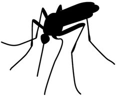

# Exploratory Data Analysis of the West Nile Virus problem dataset

&nbsp;&nbsp;&nbsp;&nbsp;&nbsp;&nbsp;&nbsp;&nbsp;&nbsp;&nbsp;&nbsp;&nbsp;&nbsp;&nbsp;&nbsp;&nbsp;&nbsp;&nbsp;&nbsp;
     
<br>

<p align="center">
  
</p>                                                                  
<p align="center">
  <a href="#intro"> Introduction </a> •
  <a href="#import"> Importing libraries and datasets </a> •
  <a href="#dd"> Data Dictionary </a> •
  <a href="#func"> Function to perform some data munging </a> •
  <a href="#corr"> Correlations and feature engineering </a> 
</p>

<a id = 'intro'></a>
# Introduction

From the [Kaggle](https://www.kaggle.com/c/predict-west-nile-virus) website:

> West Nile virus is most commonly spread to humans through infected mosquitos. Around 20% of people who become infected with the virus develop symptoms ranging from a persistent fever, to serious neurological illnesses that can result in death.

In this notebook I will perform a detailed EDA of this Kaggle dataset.

<a id = 'import'></a>
### Importing libraries and datasets

We first import the necessary libraries and datasets from [Kaggle](https://www.kaggle.com/c/predict-west-nile-virus). The former include:
```
pandas
numpy
matplotlib
seaborn
```
<a id = 'dd'></a>
### Data Dictionary

The data description corresponding to each of the `csv` files follows:

#### Files `train.csv` and `test.csv`

- `Id`: the id of the record
- `Date`: date that the WNV test is performed
- `Address`: approximate address of the location of trap. This is used to send to the GeoCoder. 
- `Species`: the species of mosquitos
- `Block`: block number of address
- `Street`: street name
- `Trap`: Id of the trap
- `AddressNumberAndStreet`: approximate address returned from GeoCoder
- `Latitude, Longitude`: Latitude and Longitude returned from GeoCoder
- `AddressAccuracy`: accuracy returned from GeoCoder
- `NumMosquitos`: number of mosquitoes caught in this trap
- `WnvPresent`: whether West Nile Virus was present in these mosquitos. 1 means WNV is present, and 0 means not present. 
 

#### File `spray.csv` 

- `Date, Time`: the date and time of the spray
- `Latitude, Longitude`: the Latitude and Longitude of the spray


#### File `weather.csv` 
- Column descriptions can be found in this [pdf](https://github.com/marcotav/eda-west-nile-virus/blob/master/noaa_weather_qclcd_documentation.pdf)


<a id = 'func'></a>
### Function to perform some data munging

I first defined a function to perform some of the simplest steps of the EDA:

```
def eda(df):
    print("1) Are there missing values:")
    if df.isnull().any().unique().shape[0] == 2:
        if df.isnull().any().unique()[0] == False and df.isnull().any().unique()[1] == False:
            print('No\n')
        else:
            print("Yes|Percentage of missing values in each column:\n",df.isnull().sum()/df.shape[0],'\n')
    elif df.isnull().any().unique().shape[0] == 1:
        if df.isnull().any().unique() == False:
            print('No\n')
        else:
            print("Yes|Percentage of missing values in each column:\n",df.isnull().sum()/df.shape[0],'\n')

    print("2) Which are the data types:\n")
    print(df.dtypes,'\n')
    print("3) Dataframe shape:",df.shape)
    print("4) Unique values per columm")
    for col in df.columns.tolist():
        print (col,":",df[col].nunique())  
    print("5) Removing duplicates")
    print('Initial shape:',df.shape)
    df.groupby(df.columns.tolist()).size().reset_index().rename(columns={0:'count'}).sort_values('count',ascending=False).head()
    df.drop_duplicates(inplace=True)
    print('Shape after removing duplicates:',df.shape)
    return
```

Looking at `train` `DataFrame` we find that:
- Address features are redundant and some of them can be removed
- `NumMosquitos` and `WnvPresent` are not in the test set. 
- I will remove `NumMosquitos` since the number of mosquitos is less relevant than whether West Nile Virus was present in these mosquitos.
- There are many duplicates which were removed using the function `eda( )`
- Only `Species` can be transformed into dummies. The others have too many unique values.
- Using `value_counts` we find that the `WnvPresent` column is highly unbalanced with ~ 95% of zeros.
- Other steps include:
  - Creating dummies from `Species`
  - Breaking up dates columns
- Similiar changes are applied to the test `DataFrame`

Now, we look at the `spray` data and perform similar steps. We see that there are several `NaNs` but the percentage is low. We can either drop `NaNs` or remove the column altogether. The second option seems to make more sense since time does look like a relevant variable

Looking at the `weather` `DataFrame`, the `Water1` column has just 1 value namely  `M` and the latter means missing. We remove this column.

There are two types of `Station`, namely, 1 and 2. From Kaggle's Website Weather Data:

> Hot and dry conditions are more favorable for West Nile virus than cold and wet. 

> We provide you with the dataset from NOAA of the weather conditions of 2007 to 2014, during the months of the tests. 

> Station 1: CHICAGO O'HARE INTERNATIONAL AIRPORT Lat: 41.995 Lon: -87.933 Elev: 662 ft. above sea level

> Station 2: CHICAGO MIDWAY INTL ARPT Lat: 41.786 Lon: -87.752 Elev: 612 ft. above sea level
    
Each date had 2 records, 1 for each `Station=1` and other for `Station=2`. However most missing values are in the latter which we will drop.

The `for` below searches each column for data that cannot be converted to numbers:
```
for station in [1,2]:
    print('Station',station,'\n')
    weather_station = weather[weather['Station']==station]
    for col in weather_station[cols_to_keep]:
        for x in sorted(weather_station[col].unique()):
            try:
                x = float(x)
            except:
                print(col,'| Non-convertibles, their frequency and their station:',\
                      (x,weather_station[weather_station[col] == x][col].count()))
```
Indeed, as stated above, most missing values are in the station 2. We will there drop rows with `Station=2`. The strings 'T' and 'M' stand for trace and missing data. Traces are defined to be smaller that 0.05. Following cells take care of that:

```
cols_with_M = ['WetBulb', 'StnPressure', 'SeaLevel']
for col in cols_with_M:
    weather[col] = weather[col].str.strip()
    weather[col] = weather[col].str.replace('M','0.0').astype(float) 
cols_with_T = ['SnowFall', 'PrecipTotal']
for col in cols_with_T:
    weather[col] = weather[col].str.replace('  T','0.05').astype(float)  
for col in cols_to_keep:
    weather[col] = weather[col].astype(float)
```

We also notice that there are many zeros in the data, in particular in the columns

```
cols_zeros = ['Heat','Cool','SnowFall']
```
        
there is a substantial quantity of zeros. We will drop these.

If `CodeSum` entries are letters, they indicate some significant weather event. We can dummify it.

Let us use regex. We use `'^\w'` to match a string consisting of a single character where that character is alphanumeric (the '\w' means "any word character"), an underscore or an asterisk.

```
weather['CodeSum'].str.strip()  # strips empty spaces
weather['CodeSum'][weather['CodeSum'].str.contains('^\w')] = '1'
weather['CodeSum'][weather['CodeSum'] !='1'] = '0'
weather['CodeSum']= weather['CodeSum'].astype(int)
```
<a id = 'corr'></a>
## Correlations and feature engineering

Three heatmaps for correlations follow below:


<p align="center">
  
</p>   


<p align="center">
  
</p>


<p align="center">
  
</p>


## To be continued.
